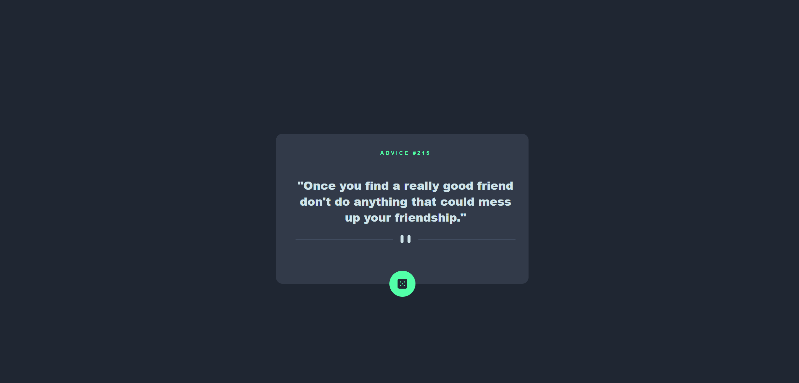
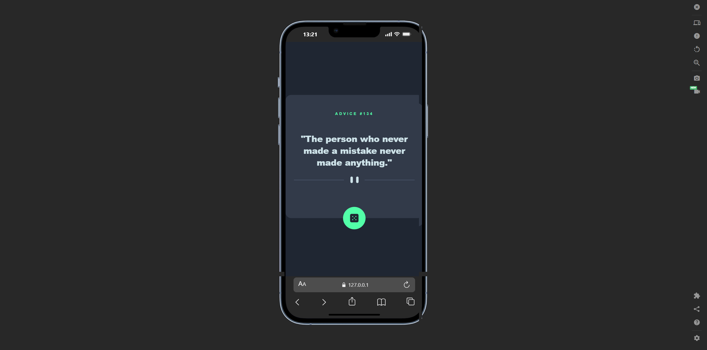

🎲 Advice Generator App
A sleek, interactive advice generator built as a Frontend Mentor challenge. This project focuses on clean UI/UX, responsive design, and seamless API integration.

🚀 The Challenge
The goal of this project was to build an advice generator app that pulls data from the Advice Slip API and matches the provided design as closely as possible.

Users should be able to:

View an optimal layout depending on their device's screen size.

See hover states for all interactive elements.

Generate a new piece of advice by clicking the dice icon.

🛠️ My Process
Built With
HTML5: Semantic markup for accessibility.

CSS3: Custom properties (variables), Flexbox, and Mobile-first media queries.

JavaScript: Asynchronous programming using fetch and async/await.

What I Learned
During this project, I deepened my understanding of:

API Integration: Successfully fetching data from a third-party API and handling the JSON response.

CSS Positioning: Using absolute positioning and transform to perfectly center the dice button on the container's edge.

Responsive Design: Utilizing the <picture> tag to swap divider images based on the user's viewport.

JavaScript
// Highlighting my favorite snippet: The Async Fetch
async function getAdvice() {
  const response = await fetch(`https://api.adviceslip.com/advice?t=${Math.random()}`);
  const data = await response.json();
  // ... update UI logic
}
📸 Screenshots
Desktop View

Mobile View

🔗 Links
Live Site URL: [Add your live link here (GitHub Pages/Vercel)]

Solution URL: [Add your Frontend Mentor solution link here]

👩‍💻 Author
Sussana Teye

Frontend Mentor - [https://www.frontendmentor.io/profile/Sussana7]
